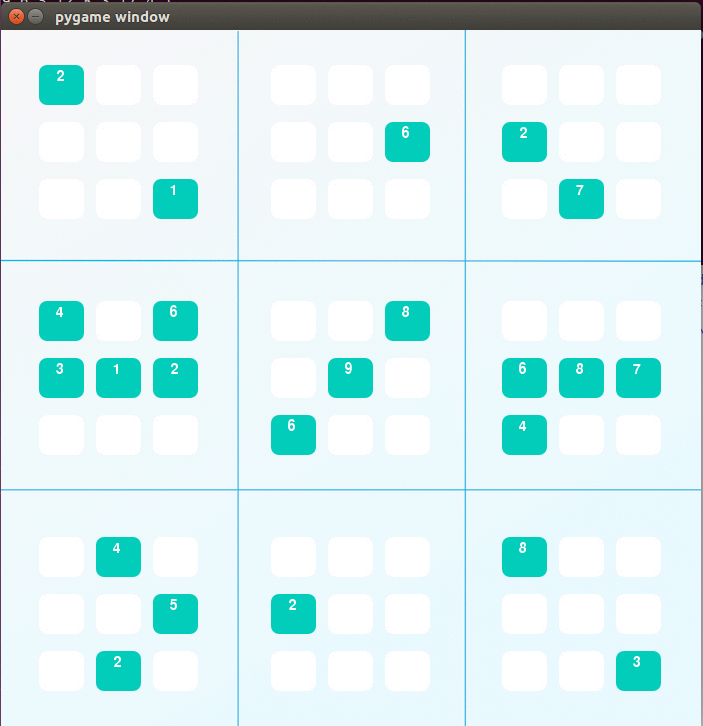

# Project 1 - Udactity AIND
## Diagonal Sudoku Solver

## Overview
In this project, we have been creating an AI agent takes advantage of constraint propagation and search techniques to solve a sudoku puzzle. We have been writing code to implement two extensions of a generic sudoku solver. The first one will be to implement the technique called "naked twins". The second one will be to modify our existing code to solve a diagonal sudoku.

## Approach
### Naked Twins
Q: How do we use constraint propagation to solve the naked twins problem?  
A: Solving the naked twins problems requires the AI agent to inspect each unit, look for potential twins by seaching for boxes with only two possibilities, checking if there are any duplicate possiblities which would indicate a twin was found, and removing these possibilities from the unit that the boxes were found in. As an improvement on the naked twins, we could expand functionality to also look for naked triplets or quadruplets (3, 4 pairs). This would require an extra loop to check for each increased length pair, which could increase runtime substantially. Given the lower likelihood of finding larger naked pairs, and the fact that there was not much difficulty in solving the puzzle with only naked twins, this strategy does not seem to be necessary.

### Diagonal Sudoku
Q: How do we use constraint propagation to solve the diagonal sudoku problem?  
A: Solving the diagonal constraint problem is straightforward, since it is simply an added constraint to our base sudoku solve problem. We must add the diagonals spanning from the upper left to bottom righ, and upper right to bottom left, to our master unit list so that these units will be checked when applying any of the solving strategies (elimination, only choice, etc). These functions are robust in that they check all possible units in the master unit list, so with the addition of the diagonal units the puzzle will be solved for this condition.

### Solution Visualization with Pygame

### Code

* `solutions.py` - various functions used for solving sudoku puzzle
* `solution_test.py` - unit tests for validating the Naked Twins and Diagonal solution methods in `solutions.py`
* `PySudoku.py` - visualization of sudoku puzzle
* `visualize.py` - visualization of sudoku puzzle

##### Optional: Pygame

You can also install pygame if you want to see a visualization. See download and installation instructions [here](http://www.pygame.org/download.shtml).

##### More Info

To see the the original repository hosted by Udacity, click [here](https://github.com/udacity/AIND-Sudoku)
